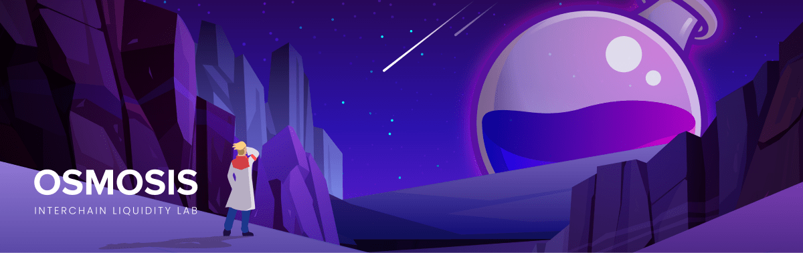

<<<<<<< HEAD
# Osmosis



[](https://www.repostatus.org/#active)
[](https://pkg.go.dev/github.com/osmosis-labs/osmosis/v11)
[](https://goreportcard.com/report/github.com/osmosis-labs/osmosis/v11)
[](https://github.com/osmosis-labs/osmosis/releases/latest)
[](https://github.com/osmosis-labs/osmosis/blob/main/LICENSE)
[](https://github.com/osmosis-labs/osmosis)
[](https://github.com/marketplace/actions/super-linter)
[](https://discord.gg/osmosis)

Osmosis is a fair-launched, customizable automated market maker for
interchain assets that allows the creation and management of
non-custodial, self-balancing, interchain token index similar to one of
Balancer.

Inspired by [Balancer](http://balancer.finance/whitepaper) and Sunny
Aggarwal's '[DAOfying Uniswap Automated Market Maker
Pools](https://www.sunnya97.com/blog/daoifying-uniswap-automated-market-maker-pools)',
the goal for Osmosis is to provide the best-in-class tools that extend
the use of AMMs within the Cosmos ecosystem beyond traditional token
swap-type use cases. Bonding curves, while have found its primary use
case in decentralized exchange mechanisms, its potential use case can be
further extended through the customizability that Osmosis offers.
Through the customizability offered by Osmosis such as custom-curve AMMs,
dynamic adjustments of swap fees, multi-token liquidity pools--the AMM
can offer decentralized formation of token fundraisers, interchain
staking, options market, and more for the Cosmos ecosystem.

Whereas most Cosmos zones have focused their incentive scheme on the
delegators, Osmosis attempts to align the interests of multiple
stakeholders of the ecosystem such as LPs, DAO members, as well as
delegators. One mechanism that is introduced is how staked liquidity
providers have sovereign ownership over their pools, and through the
pool governance process allow them to adjust the parameters depending on
the pool's competition and market conditions. Osmosis is a sovereign
Cosmos zone that derives its sovereignty not only from its
application-specific blockchain architecture but also the collective
sovereignty of the LPs that has aligned interest to different tokens
that they are providing liquidity for.

## System Requirements

This system spec has been tested by many users and validators and found
to be comfortable:

- Quad Core or larger AMD or Intel (amd64) CPU
  - ARM CPUs like the Apple M1 are not supported at this time.
- 64GB RAM (A lot can be in swap)
- 1TB NVMe Storage
- 100MBPS bidirectional internet connection

You can run Osmosis on lower-spec hardware for each component, but you
may find that it is not highly performant or prone to crashing.

## Documentation

For the most up to date documentation please visit
[docs.osmosis.zone](https://docs.osmosis.zone/)

## Joining the Mainnet

[Please visit the official instructions on how to join the Mainnet
here.](https://docs.osmosis.zone/networks/join-mainnet)

Thank you for supporting a healthy blockchain network and community by
running an Osmosis node!

## Contributing

The contributing guide for Osmosis explains the branching structure, how
to use the SDK fork, and how to make / test updates to SDK branches.
=======
# IBC-hooks

## Wasm Hooks

The wasm hook is an IBC middleware which is used to allow ICS-20 token transfers to initiate contract calls.
This allows cross-chain contract calls, that involve token movement. 
This is useful for a variety of usecases.
One of primary importance is cross-chain swaps, which is an extremely powerful primitive.

The mechanism enabling this is a `memo` field on every ICS20 transfer packet as of [IBC v3.4.0](https://medium.com/the-interchain-foundation/moving-beyond-simple-token-transfers-d42b2b1dc29b).
Wasm hooks is an IBC middleware that parses an ICS20 transfer, and if the `memo` field is of a particular form, executes a wasm contract call. We now detail the `memo` format for `wasm` contract calls, and the execution guarantees provided.

### Cosmwasm Contract Execution Format

Before we dive into the IBC metadata format, we show the cosmwasm execute message format, so the reader has a sense of what are the fields we need to be setting in.
The cosmwasm `MsgExecuteContract` is defined [here](https://github.com/CosmWasm/wasmd/blob/4fe2fbc8f322efdaf187e2e5c99ce32fd1df06f0/x/wasm/types/tx.pb.go#L340-L349
) as the following type:

```go
type MsgExecuteContract struct {
	// Sender is the that actor that signed the messages
	Sender string
	// Contract is the address of the smart contract
	Contract string
	// Msg json encoded message to be passed to the contract
	Msg RawContractMessage
	// Funds coins that are transferred to the contract on execution
	Funds sdk.Coins
}
```

So we detail where we want to get each of these fields from:

* Sender: We cannot trust the sender of an IBC packet, the counterparty chain has full ability to lie about it. 
We cannot risk this sender being confused for a particular user or module address on Osmosis.
So we hardcode the sender to be a particular module account made in IBC.
* Contract: This field should be directly obtained from the ICS-20 packet metadata
* Msg: This field should be directly obtained from the ICS-20 packet metadata.
* Funds: This field is set to the amount of funds being sent over in the ICS 20 packet. One detail is that the denom in the packet is the counterparty chains representation of the denom, so we have to translate it to Osmosis' representation.

So our constructed cosmwasm message that we execute will look like:

```go
msg := MsgExecuteContract{
	// Sender is the that actor that signed the messages
	Sender: "osmo1-hardcoded-moduleAccount",
	// Contract is the address of the smart contract
	Contract: packet.data.memo["wasm"]["ContractAddress"],
	// Msg json encoded message to be passed to the contract
	Msg: packet.data.memo["wasm"]["Msg"],
	// Funds coins that are transferred to the contract on execution
	Funds: sdk.NewCoin{Denom: ibc.ConvertSenderDenomToLocalDenom(packet.data.Denom), Amount: packet.data.Amount}
```

### ICS20 packet structure

So given the details above, we propogate the implied ICS20 packet data structure.
ICS20 is JSON native, so we use JSON for the memo format.

```json 
{
    //... other ibc fields that we don't care about
    "data":{
    	"denom": "denom on counterparty chain (e.g. uatom)",
        "amount": "1000",
        "sender": "...", // ignored
        "receiver": "contract addr or blank",
    	"memo": {
           "wasm": {
              "contract": "osmo1contractAddr",
              "msg": {
                "raw_message_fields": "raw_message_data",
              }
            }
        }
    }
}
```

An ICS20 packet is formatted correctly for wasmhooks iff the following all hold:

* `memo` is not blank
* `memo` is valid JSON
* `memo` has at least one key, with value `"wasm"`
* `memo["wasm"]` has exactly two entries, `"contract"` and `"msg"`
* `memo["wasm"]["msg"]` is a valid JSON object
* `receiver == "" || receiver == memo["wasm"]["contract"]`

We consider an ICS20 packet as directed towards wasmhooks iff all of the following hold:

* `memo` is not blank
* `memo` is valid JSON
* `memo` has at least one key, with name `"wasm"`

If an ICS20 packet is not directed towards wasmhooks, wasmhooks doesn't do anything.
If an ICS20 packet is directed towards wasmhooks, and is formated incorrectly, then wasmhooks returns an error.

### Execution flow

Pre wasm hooks:

* Ensure the incoming IBC packet is cryptogaphically valid
* Ensure the incoming IBC packet is not timed out.

In Wasm hooks, pre packet execution:

* Ensure the packet is correctly formatted (as defined above)
* Edit the receiver to be the hardcoded IBC module account

In wasm hooks, post packet execution:

* Construct wasm message as defined before
* Execute wasm message
* if wasm message has error, return ErrAck
* otherwise continue through middleware

## Ack callbacks

A contract that sends an IBC transfer, may need to listen for the ACK from that packet. To allow
contracts to listen on the ack of specific packets, we provide Ack callbacks. 

### Design

The sender of an IBC transfer packet may specify a callback for when the ack of that packet is received in the memo 
field of the transfer packet. 

Crucially, _only_ the IBC packet sender can set the callback.

### Use case

The crosschain swaps implementation sends an IBC transfer. If the transfer were to fail, we want to allow the sender
to be able to retrieve their funds (which would otherwise be stuck in the contract). To do this, we allow users to 
retrieve the funds after the timeout has passed, but without the ack information, we cannot guarantee that the send 
hasn't failed (i.e.: returned an error ack notifying that the receiving change didn't accept it)

### Implementation

#### Callback information in memo

For the callback to be processed, the transfer packet's memo should contain the following in its JSON:

`{"ibc_callback": "osmo1contractAddr"}`

The wasm hooks will keep the mapping from the packet's channel and sequence to the contract in storage. When an ack is
received, it will notify the specified contract via a sudo message.

#### Interface for receiving the Ack

The contract that awaits the callback should implement the following interface for a sudo message:

* `ReceiveAck { channel: String, sequence: u64, ack: String, success: bool }`

# Testing strategy

See go tests.# ibc-hooks
>>>>>>> 09d08e39a61ce0f445691e60965f956eee3f0eca
